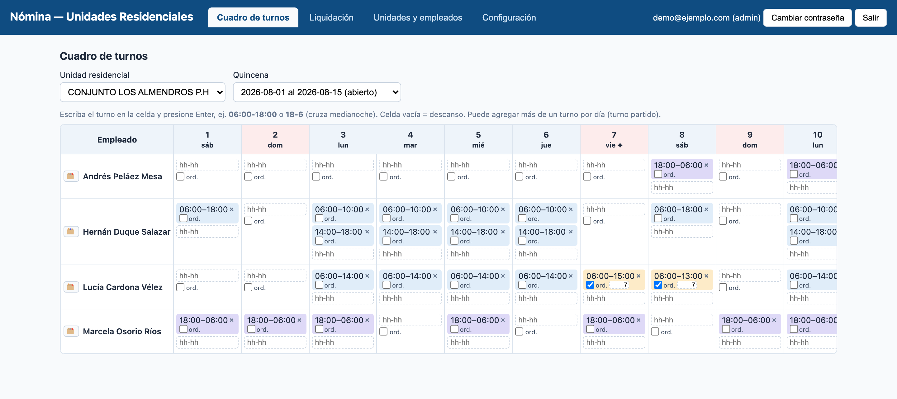
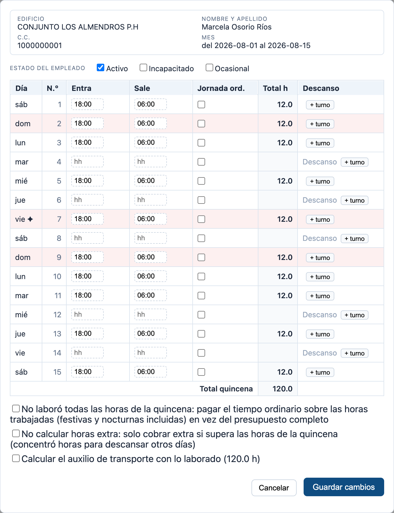

# Nómina de Unidades Residenciales

Aplicación de **liquidación de nómina quincenal** para el personal de unidades
residenciales en Colombia (vigilantes, aseo, toderos): ingreso del cuadro de turnos,
cálculo automático de recargos, horas extra y deducciones según la normativa laboral
colombiana, y exportación al Excel con el formato de la contadora.

El criterio de aceptación del proyecto es concreto: **el Excel que produce la aplicación
tiene que cuadrar con el cálculo manual de la contadora**, peso por peso.

- 📘 **[Manual de usuario](docs/manual-usuario.md)** — cómo usar cada sección, con capturas.
- 🏗️ **[Documento de arquitectura](docs/arquitectura.md)** — diseño, modelo de datos y motor de cálculo en detalle.
- 🤝 **[CLAUDE.md](CLAUDE.md)** — reglas de trabajo del repo y glosario del dominio.





---

## Índice

1. [Qué resuelve](#qué-resuelve)
2. [Regla de oro](#regla-de-oro)
3. [Arquitectura](#arquitectura)
4. [Componentes del backend](#componentes-del-backend)
5. [Componentes del frontend](#componentes-del-frontend)
6. [API REST](#api-rest)
7. [Motor de cálculo](#motor-de-cálculo)
8. [Modelo de datos](#modelo-de-datos)
9. [Seguridad](#seguridad)
10. [Puesta en marcha](#puesta-en-marcha)
11. [Datos de demostración](#datos-de-demostración)
12. [Tests y calidad](#tests-y-calidad)
13. [Despliegue](#despliegue)

---

## Qué resuelve

Una unidad residencial paga a su personal por quincenas. El salario quincenal cubre un
presupuesto de horas ordinarias, y **encima** de eso hay que reconocer:

- **recargo nocturno** por trabajar dentro de la jornada nocturna (hoy 19:00–06:00);
- **recargo dominical/festivo** por trabajar domingos y festivos;
- **horas extra** diurnas y nocturnas, con su propio recargo si además caen en festivo;
- **auxilio de transporte**, completo o prorrateado;
- **deducciones** (salud, pensión, préstamos, cuotas fijas de la unidad).

Todo eso se calculaba a mano en una planilla. Esta aplicación lo automatiza: se digitan
los turnos y el motor parte cada turno en tramos homogéneos, clasifica cada tramo y le
aplica el factor legal vigente **en la fecha de ese tramo**.

---

## Regla de oro

**Ningún valor legal está quemado en el código.** Porcentajes, horarios de jornada
nocturna, jornada máxima, horas de la quincena y divisores viven en la tabla
`parametro_legal` con vigencias (`vigente_desde` / `vigente_hasta`), y el motor resuelve
el valor vigente **en la fecha del tramo del turno** — nunca en la fecha del sistema ni en
la de liquidación.

La razón es que la ley colombiana cambia de forma escalonada: en julio de 2026 hay dos
cambios con fechas distintas (recargo dominical 80 → 90 % el 1-jul y jornada 44 → 42 h el
15-jul). Liquidar una quincena vieja tiene que seguir dando el mismo resultado de siempre.

Dos avisos que ya costaron un error de dinero (detalle en [CLAUDE.md](CLAUDE.md)):

- `horas_quincena` y `divisor_hora_ordinaria` **se mueven siempre juntos**
  (`divisor == 2 × horas_quincena`). Lo verifica `incoherencias_horas_quincena()` y la
  pantalla de Configuración avisa si se descuadran.
- `sembrar_parametros` es idempotente **por código**: cambiar la vigencia de un parámetro
  ya sembrado exige una **migración de datos**, no basta con editar la semilla.

---

## Arquitectura

Hexagonal, con las dependencias apuntando siempre hacia adentro:

```
┌─────────────────────────────────────────────────────────┐
│ infraestructura   API FastAPI · SQLAlchemy · Excel · Auth│
│   ┌─────────────────────────────────────────────────┐   │
│   │ aplicacion    casos de uso + puertos            │   │
│   │   ┌─────────────────────────────────────────┐   │   │
│   │   │ dominio   PURO: solo stdlib             │   │   │
│   │   │  entidades · valores · servicios        │   │   │
│   │   └─────────────────────────────────────────┘   │   │
│   └─────────────────────────────────────────────────┘   │
└─────────────────────────────────────────────────────────┘
```

- **`dominio/`** es puro: solo la librería estándar. Sin FastAPI, sin SQLAlchemy, sin
  Pydantic, sin I/O. Recibe parámetros y festivos **como datos**, nunca los consulta.
- **`aplicacion/`** orquesta casos de uso y define los puertos (Protocols) que la
  infraestructura implementa.
- **`infraestructura/`** implementa los puertos: persistencia, API, Excel, seguridad.

La regla se verifica automáticamente con `import-linter` (contratos en
`backend/pyproject.toml`): hay un contrato de capas y otro que prohíbe importar
`fastapi`, `sqlalchemy`, `alembic`, `pydantic` u `openpyxl` dentro de `nomina.dominio`.

**Convenciones no negociables:** dinero y porcentajes en `Decimal` (nunca `float`;
`NUMERIC` en BD) · duraciones en minutos enteros · redondeo una sola vez, al final, por
concepto, a pesos con `ROUND_HALF_UP` · zona horaria `America/Bogota` explícita en todo
datetime de negocio (auditoría en UTC) · IDs UUID · dominio y casos de uso en español.

---

## Componentes del backend

`backend/src/nomina/` — Python 3.12, gestionado con `uv`.

### `dominio/valores/` — objetos de valor

| Archivo | Qué contiene |
|---|---|
| `tiempo.py` | `BOGOTA` (`ZoneInfo`), `MINUTOS_POR_HORA` |
| `tramo.py` | `Franja` (diurna/nocturna), `TipoDia` (ordinario/dominical/festivo) y `Tramo`, el fragmento homogéneo de turno. Un tramo **nunca** cruza medianoche |
| `vigencia.py` | `Vigencia(desde, hasta)` con `contiene()` y `se_solapa_con()` |

### `dominio/entidades/` — el lenguaje del negocio

| Archivo | Qué contiene |
|---|---|
| `turno.py` | `Turno` (fecha, hora inicio/fin, `minutos_jornada_ordinaria`), `TurnoRegistrado`, `validar_sin_solapamientos()`. Si `hora_fin <= hora_inicio` el turno cruza medianoche |
| `empleado.py` | `Empleado` con sus invariantes (nombre, documento, salario > 0, `activo`/`incapacitado`/`ocasional`) |
| `unidad_residencial.py` | `UnidadResidencial` y `ConfiguracionUnidad` (`estrategia_extras`, `factores_override`, `conceptos_fijos`) |
| `periodo_liquidacion.py` | `PeriodoLiquidacion` y `EstadoPeriodo` (abierto → liquidado → cerrado; cerrado es irreversible) |
| `parametro_legal.py` | `CODIGOS_PARAMETROS`, `ParametroLegal`, `ConjuntoParametros` (resuelve valores por fecha y valida que las vigencias no se solapen) e `incoherencias_horas_quincena()` |
| `concepto_liquidado.py` | `ConceptoLiquidado` (minutos × tarifa × factor, con el desglose de `componentes`), `ConceptoManual` y `Liquidacion` |
| `usuario.py` | `Rol` jerárquico (`operador ⊂ contadora ⊂ admin`) con `al_menos()` |

### `dominio/puertos/` — interfaces (Protocols)

`parametros.py` define `ProveedorParametros`; `repositorios.py` define los repositorios de
unidades, empleados, periodos, turnos, parámetros y festivos. El dominio solo conoce estas
formas, nunca su implementación.

### `dominio/servicios/` — el motor

| Archivo | Qué hace |
|---|---|
| `segmentador.py` | `segmentar()` / `segmentar_turnos()`: parte cada turno en tramos homogéneos |
| `clasificador_extras.py` | `clasificar_extras()`: decide qué tramos son ordinarios y cuáles extra, según la estrategia |
| `calculadora.py` | `liquidar()`: aplica los factores, agrupa por concepto, redondea y arma la `Liquidacion` |
| `calendario_festivos.py` | `festivos_por_ley()` (fijos + Ley Emiliani + relativos a Pascua) y `CalendarioFestivos` con altas y anulaciones manuales |

### `aplicacion/casos_uso/`

| Archivo | Caso de uso |
|---|---|
| `registrar_turno.py` | Valida que el empleado exista y esté activo, que la fecha caiga en un periodo abierto y que el turno no se solape |
| `liquidar_quincena.py` | Orquesta el cálculo de una unidad completa; versiona el resultado y guarda un **snapshot de todos los parámetros** usados |
| `marcar_periodo_liquidado.py` | Paso explícito abierto → liquidado (exige al menos una liquidación) |
| `cerrar_quincena.py` | Paso liquidado → cerrado (solo lectura definitiva) |
| `actualizar_parametro.py` | Nunca edita historia: cierra la vigencia abierta el día anterior y abre una nueva; valida el conjunto resultante antes de tocar la BD |
| `exportar_liquidacion.py` | Arma el nombre del archivo y delega en el puerto `ExportadorLiquidacion` |

`errores.py` define `NoEncontradoError` (→ 404) y `ReglaDeNegocioError` (→ 409).

### `infraestructura/`

| Módulo | Qué hace |
|---|---|
| `config.py` | `Settings` por variables de entorno / `.env` (incluye la reescritura de `postgres://` a `postgresql+psycopg://` que necesita Railway) |
| `api/app.py` | Fábrica de la app: routers, manejadores de excepciones, cabeceras de seguridad, CORS, siembra de parámetros al arranque y servido de la SPA si hay `STATIC_DIR` |
| `api/rutas.py` · `api/rutas_auth.py` | Los endpoints (ver abajo) |
| `api/schemas.py` · `api/traductores.py` | Modelos Pydantic y traducción dominio → schema |
| `persistencia/base.py` | Engine, fábrica de sesiones y la dependencia `sesion()` (una sesión por request) |
| `persistencia/modelos.py` | Las tablas SQLAlchemy |
| `persistencia/repositorios.py` | Los adaptadores SQL de cada puerto |
| `persistencia/sembrar*.py` | Semillas: parámetros legales, unidades reales de referencia y datos de demostración |
| `excel/exportador.py` | Genera el `.xlsx` con openpyxl |
| `seguridad/auth.py` · `contrasenas.py` · `auditoria.py` · `crear_admin.py` | Sesiones, Argon2id, auditoría y bootstrap del primer admin |

### Módulos de datos y utilidades

| Archivo | Qué es |
|---|---|
| `cli.py` | Prueba el motor sin BD ni UI: `python -m nomina.cli --salario ... --desde ... --turno "..."` |
| `semilla.py` | `PARAMETROS_SEMILLA`: los valores legales con sus vigencias y la norma que los sustenta |
| `puebla.py` · `thunapa.py` · `julio_1_15.py` | Datos **reales** reconstruidos que sirven de referencia a los golden tests |
| `demo.py` | Datos **ficticios** para probar la app y generar las capturas del manual |

---

## Componentes del frontend

`frontend/src/` — React 18 + TypeScript + Vite, sin librerías adicionales.

| Archivo | Qué hace |
|---|---|
| `App.tsx` | Shell de la aplicación: sesión, barra superior y conmutador de pestañas. **No hay router**: la navegación es estado local, y la visibilidad de cada pestaña depende del rol (`RANGO`). Esa comprobación es solo comodidad de UI — el backend verifica siempre |
| `api.ts` | Cliente HTTP contra `/api`. Centraliza el manejo de errores y, ante un 401, emite el evento `nomina:no-autenticado` que devuelve al login |
| `tipos.ts` | Tipos TypeScript espejo de los schemas del backend |
| `turnos-util.ts` | Utilidades compartidas por la grilla y la tarjeta: `normalizarHora()`, `minutosDeTurno()`, `horasAMinutos()`, `ventanaJornadaOrdinaria()` y `esTurnoDeRelleno()` |
| `estilos.css` | Hoja de estilos única |

### Pantallas (`src/paginas/`)

| Componente | Pestaña | Rol mínimo | Qué hace |
|---|---|---|---|
| `Login.tsx` | — | público | Ingreso con correo y contraseña |
| `CambiarContrasena.tsx` | — | autenticado | Modal para cambiar la propia contraseña |
| `GrillaTurnos.tsx` | Cuadro de turnos | operador | Matriz empleados × días de la quincena. Cada turno se escribe en su celda y se guarda al instante |
| `PreviaTurnosEmpleado.tsx` | (modal) | operador | **Tarjeta de turnos** de un solo empleado, con los días en filas. Edición diferida, jornada ordinaria, turnos de relleno y los tres ajustes de quincena |
| `Liquidacion.tsx` | Liquidación | contadora | Liquidar una unidad, ver el desglose por empleado y descargar el Excel |
| `Entidades.tsx` | Unidades y empleados | contadora | Cinco secciones: unidades, conceptos fijos, empleados, conceptos manuales y periodos |
| `Configuracion.tsx` | Configuración | admin | Parámetros legales con vigencias, festivos, usuarios y auditoría |

La pantalla más densa es la **previsualización**; el [manual de usuario](docs/manual-usuario.md#6-previsualización-de-turnos-formato-tarjeta)
la explica control por control.

---

## API REST

Todo cuelga de `/api`. Los roles son jerárquicos: *contadora* satisface *operador* y
*admin* satisface a los dos.

### Autenticación y usuarios

| Método | Ruta | Propósito | Rol |
|---|---|---|---|
| POST | `/auth/login` | Ingresar; deja la cookie `sesion` HttpOnly. Con límite de intentos por IP | público |
| POST | `/auth/logout` | Cerrar sesión | autenticado |
| GET | `/auth/yo` | Usuario actual | autenticado |
| PUT | `/auth/yo/contrasena` | Cambiar la propia contraseña | autenticado |
| GET | `/usuarios` | Listar usuarios | admin |
| POST | `/usuarios` | Crear usuario | admin |
| POST | `/usuarios/{id}/desactivar` | Desactivar y cerrar sus sesiones | admin |
| GET | `/auditoria` | Últimos registros de auditoría | admin |

### Entidades

| Método | Ruta | Propósito | Rol |
|---|---|---|---|
| GET · POST | `/unidades` | Listar / crear unidades | operador · contadora |
| PATCH | `/unidades/{id}` | Editar nombre, NIT, descuento de SS y `config` | contadora |
| GET · POST | `/empleados` | Listar (por unidad) / crear | operador · contadora |
| PATCH · DELETE | `/empleados/{id}` | Editar / eliminar (409 si tiene datos asociados) | contadora |
| GET · POST | `/conceptos-manuales` | Devengados y deducciones por empleado y periodo | operador · contadora |
| DELETE | `/conceptos-manuales/{id}` | Quitar | contadora |
| GET · POST | `/periodos` | Listar / crear quincenas | operador · contadora |
| PATCH | `/periodos/{id}` | Editar fechas (solo si está abierto) | contadora |
| POST | `/periodos/{id}/reabrir` | Reabrir (falla si está cerrado) | contadora |
| POST | `/periodos/{id}/liquidar-periodo` | Marcar el periodo como liquidado | contadora |
| POST | `/periodos/{id}/cerrar` | Cierre definitivo | contadora |

### Turnos y ajustes

| Método | Ruta | Propósito | Rol |
|---|---|---|---|
| GET | `/periodos/{id}/turnos` | Cuadro de turnos del periodo | operador |
| POST · DELETE | `/turnos` · `/turnos/{id}` | Registrar / eliminar turno | operador |
| PATCH | `/turnos/{id}/jornada-ordinaria` | Poner o quitar la marca de jornada ordinaria | operador |
| GET · PUT | `/ajustes-quincena` | Las tres marcas por empleado y periodo | operador |

### Parámetros y festivos

| Método | Ruta | Propósito | Rol |
|---|---|---|---|
| GET | `/parametros` | Historial completo, o los vigentes en una fecha | operador |
| GET | `/parametros/coherencia` | Parámetros acoplados que quedaron descuadrados | operador |
| POST | `/parametros` | Abrir una vigencia nueva | **admin** |
| GET | `/festivos/{anio}` | Festivos por ley + manuales − anulados | operador |
| PUT · DELETE | `/festivos` · `/festivos/{fecha}` | Agregar/anular un festivo, o quitar el ajuste | **admin** |

### Liquidaciones

| Método | Ruta | Propósito | Rol |
|---|---|---|---|
| POST | `/periodos/{id}/liquidar` | Liquidar una unidad → versión nueva | contadora |
| GET | `/liquidaciones` | Historial del periodo | contadora |
| GET · DELETE | `/liquidaciones/{id}` | Consultar / borrar | contadora |
| GET | `/liquidaciones/{id}/excel` | Descargar el `.xlsx` | contadora |
| GET | `/salud` | Healthcheck (lo usa `railway.toml`) | público |

---

## Motor de cálculo

El cálculo son tres pasos encadenados: **segmentar → clasificar → liquidar**.

### 1. Segmentación

Cada turno se parte en tramos homogéneos por cortes sucesivos:

1. **medianoche** (día calendario),
2. **límites de la jornada nocturna** vigentes ese día,
3. **tipo de día**: festivo > dominical > ordinario.

La regla de la contadora («el sábado que amanece festivo cambia a festivo a las 12 de la
noche») **emerge** del corte por medianoche: no es un caso especial en el código.

> **Invariante:** la suma de los minutos de los tramos es siempre igual a la duración del
> turno. Está verificada con tests de propiedades (hypothesis).

### 2. Clasificación de extras

Qué cuenta como hora extra depende de una estrategia parametrizable
(`estrategia_clasificacion_extras`, sobreescribible por unidad):

| Estrategia | Regla |
|---|---|
| `presupuesto_quincenal` *(por defecto)* | Las primeras `horas_quincena` (105) en orden cronológico son ordinarias; el resto, extra. Es el método actual de la contadora |
| `semanal_legal` | Acumulador por semana ISO contra `jornada_maxima_semanal` (46 → 45 → 44 → 42) |
| `diaria` | Por día calendario contra `horas_jornada_diaria` (8 h) |
| `jornada` | Por bloque de turno continuo; un descanso abre una jornada nueva |

### 3. Modelo de pago **aditivo**

El salario quincenal (`horas_quincena × tarifa`, con `tarifa = salario / divisor_hora_ordinaria`)
ya cubre las horas ordinarias. Cada tramo paga solo el **factor adicional componible**:

| Situación | Factor | Por qué |
|---|---|---|
| Hora ordinaria diurna en día ordinario | — | Ya la cubre el salario |
| Hora ordinaria nocturna | `0.35` | Solo el recargo |
| Hora en dominical/festivo | `1 + recargo` | La hora completa otra vez: el descanso ya estaba remunerado |
| Hora extra diurna | `1 + 0.25` | |
| Hora extra nocturna dominical | `1 + 0.75 + recargo_dominical` | Componentes que se suman |

Nunca hay una lista plana de porcentajes combinados a mano. Cada `ConceptoLiquidado`
guarda sus `componentes`, así que el desglose es auditable — en la UI aparecen como
tooltip sobre el nombre del concepto. Detalle completo en
[`docs/arquitectura.md` §5.3](docs/arquitectura.md).

### Casos especiales

- **Jornada ordinaria (marca por turno):** el turno se registró solo para cuadrar las horas
  de la quincena, no porque se trabajara. Sus primeros N minutos no pagan recargo
  dominical/festivo ni nocturno; solo el excedente se reconoce, como hora extra con su
  tipo de día real. Lo resuelve la segmentación, no el clasificador.
- **Quincena incompleta (marca por empleado y quincena):** el tiempo ordinario se paga
  sobre «lo laborado» (todos los minutos no-extra, festivos y nocturnos incluidos) en vez
  del presupuesto completo.
- **Auxilio prorrateado (marca por empleado y quincena):** `mensual × horas / divisor`, en
  vez del quincenal plano. Manda sobre `incapacitado` / `ocasional`.

---

## Modelo de datos

PostgreSQL en producción, SQLite en desarrollo. IDs UUID, dinero en enteros de pesos,
tasas y factores como `Decimal` exacto.

| Tabla | Contenido |
|---|---|
| `unidad_residencial` | Unidad, NIT, si descuenta seguridad social y su `config` JSON |
| `empleado` | Datos del empleado y su salario base (dato sensible, Ley 1581/2012) |
| `periodo_liquidacion` | Quincena y su estado |
| `turno` | Intervalo trabajado, con `minutos_jornada_ordinaria` |
| `parametro_legal` | Valores legales con vigencias que no se solapan |
| `festivo` | Ajustes manuales al calendario (altas y anulaciones) |
| `liquidacion` | Corrida versionada por periodo + unidad, con `parametros_snapshot` |
| `liquidacion_empleado` · `concepto_liquidado` | El desglose resultante |
| `concepto_manual` | Devengados y deducciones puntuales |
| `ajuste_quincena` | Las tres marcas por empleado y periodo |
| `usuario` · `sesion` | Autenticación |
| `auditoria` | **Append-only**: triggers de BD rechazan `UPDATE` y `DELETE` |

Las migraciones están en `backend/alembic/versions/`. Incluyen una migración de datos
(`c1b7e40a9f38`) que sirve de plantilla para cuando cambia la vigencia de un parámetro ya
sembrado.

---

## Seguridad

- **Contraseñas** con Argon2id (`argon2-cffi`).
- **Sesiones** por cookie `HttpOnly`, `SameSite=Lax`, `Secure` en producción. El token se
  genera con `secrets.token_urlsafe(32)` y en la base **solo se guarda su SHA-256**.
- **Roles jerárquicos** verificados en el backend en cada endpoint. Lo que hace el frontend
  con las pestañas es comodidad, no control de acceso.
- **Límite de intentos** de login por IP, y el mismo mensaje de error exista o no el correo.
- **Auditoría append-only**: cada escritura sensible registra usuario, acción, entidad y el
  antes/después; la base rechaza modificaciones al registro.
- **Cabeceras de seguridad** (`X-Content-Type-Options`, `X-Frame-Options: DENY`,
  `Referrer-Policy`, `Cache-Control: no-store`, HSTS en producción) y CORS restrictivo.
- **Una quincena cerrada es de solo lectura para siempre**: no se puede reabrir ni
  reliquidar. Mientras está abierta, reliquidar una unidad **reemplaza** su liquidación
  anterior (el cambio queda en la auditoría).
- **Sin credenciales en el repo**: `.env` está en `.gitignore`; hay un `.env.example`.

---

## Puesta en marcha

### Backend

```bash
cd backend
uv sync                                     # instalar dependencias
cp .env.example .env                        # y ajustar DATABASE_URL si hace falta
uv run alembic upgrade head                 # migrar la base
uv run python -m nomina.infraestructura.persistencia.sembrar   # parámetros legales

# primer usuario (la contraseña se pide por consola o va en NOMINA_ADMIN_PASSWORD)
uv run python -m nomina.infraestructura.seguridad.crear_admin --email admin@ejemplo.com

uv run uvicorn nomina.infraestructura.api.app:crear_app --factory --reload --port 8001
```

### Frontend

```bash
cd frontend
npm install        # usa el .npmrc del proyecto (registro público)
npm run dev        # http://localhost:5174, con proxy /api → backend :8001
npm run build      # verificación de tipos (tsc estricto) + build de producción
```

Los puertos **5174** y **8001** no son los habituales a propósito: en la máquina de
desarrollo original, 5173 y 8000 los ocupa otra aplicación en Docker.

### El motor sin base de datos ni UI

```bash
cd backend
uv run python -m nomina.cli \
  --salario 1750905 --desde 2026-08-01 \
  --turno "2026-08-07 18:00-06:00" --tramos
```

---

## Datos de demostración

Para probar la aplicación —o regenerar las capturas del manual— sin tocar la base de
trabajo y sin exponer datos de empleados reales:

```bash
cd backend
export DATABASE_URL=sqlite:///./nomina_demo.sqlite3
export NOMINA_ADMIN_PASSWORD='una-clave-larga'      # mínimo 10 caracteres
uv run alembic upgrade head
uv run python -m nomina.infraestructura.persistencia.sembrar_demo
```

Crea dos unidades ficticias y la quincena **1–15 de agosto de 2026** (contiene el festivo
del 7 y dos domingos), más el usuario `demo@ejemplo.com`. Los cuatro empleados de
`CONJUNTO LOS ALMENDROS P.H` están diseñados para que cada uno ilustre una función
distinta: turnos nocturnos que cruzan medianoche, turno partido, jornada ordinaria con
turno de relleno, y quincena incompleta con auxilio prorrateado.

Para regenerar las capturas del manual hace falta además la SPA compilada:

```bash
cd frontend && npm run build
cd ../backend && DATABASE_URL=sqlite:///./nomina_demo.sqlite3 \
  STATIC_DIR=../frontend/dist \
  uv run uvicorn nomina.infraestructura.api.app:crear_app --factory --port 8011

# en otra terminal, desde la raíz del repo
NOMINA_ADMIN_PASSWORD='una-clave-larga' python3 scripts/capturar-manual.py
```

---

## Tests y calidad

```bash
cd backend
uv run pytest             # cobertura mínima 90 % en el dominio
uv run ruff check .
uv run lint-imports       # verifica la regla de capas
```

`pyproject.toml` también configura `mypy` en modo estricto, pero la infraestructura todavía
arrastra anotaciones pendientes: hoy solo el dominio y los casos de uso pasan limpios.

Qué cubren los tests:

- **Golden tests** (`tests/dominio/golden/`) — el corazón del proyecto. Reproducen
  planillas reales al peso: `test_golden_quincena.py` (casos de aceptación calculados a
  mano), `test_golden_puebla.py`, `test_golden_thunapa.py` y `test_golden_lorena.py`
  (el caso que definió la regla de «liquidar sobre lo trabajado»). Las divergencias
  conocidas están documentadas en cada archivo.
- **Propiedades** (`tests/dominio/propiedades/`) con hypothesis: la segmentación conserva
  los minutos, los tramos son contiguos, todos tienen tarifa definida, y es idempotente.
- **Casos de uso y API** (`tests/test_casos_uso.py`, `tests/test_api.py`) contra una base
  SQLite en memoria.
- **Seguridad** (`tests/test_seguridad.py`): matriz de autorización por rol, rate limiting,
  inmutabilidad de la auditoría en la base y cierre definitivo de quincenas.
- **Migraciones** (`tests/test_migracion_horas_quincena.py`): corren `alembic upgrade head`
  de verdad sobre un estado heredado reproducido.

`.pre-commit-config.yaml` corre `ruff` antes de cada commit.

---

## Despliegue

`Dockerfile` multi-etapa: compila el frontend en `node:20-alpine`, lo copia a una imagen
`python:3.12-slim` con `STATIC_DIR=/app/frontend/dist`, corre `alembic upgrade head` al
arrancar y levanta uvicorn en `$PORT`. En producción el mismo origen sirve la SPA y la API,
así que no hay que configurar CORS.

`railway.toml` define el healthcheck en `/api/salud`. Las variables de entorno están
documentadas en `backend/.env.example`.

---

## Estado

Las cinco fases del plan original están completas (detalle en [CLAUDE.md](CLAUDE.md)).
Quedan pendientes de negocio: confirmar con la contadora los factores combinados y su regla
real de clasificación de extras, y verificar el auxilio de transporte 2026 contra el
decreto. **Los valores legales de referencia deben verificarse contra fuente oficial antes
de producción.**
