# Manual de usuario

Guía de uso de la aplicación de **Nómina de Unidades Residenciales**: qué hace cada
pantalla, cómo se digita una quincena y qué significa cada casilla.

> Las capturas de este manual se tomaron con datos de demostración. Los nombres, las
> cédulas y los horarios son ficticios.

## Contenido

1. [Antes de empezar](#1-antes-de-empezar)
2. [Conceptos básicos](#2-conceptos-básicos)
3. [El flujo de una quincena](#3-el-flujo-de-una-quincena)
4. [Unidades y empleados](#4-unidades-y-empleados)
5. [Cuadro de turnos](#5-cuadro-de-turnos)
6. [Previsualización de turnos (formato tarjeta)](#6-previsualización-de-turnos-formato-tarjeta)
7. [Liquidación y Excel](#7-liquidación-y-excel)
8. [Configuración](#8-configuración)
9. [Cerrar la quincena](#9-cerrar-la-quincena)
10. [Problemas frecuentes](#10-problemas-frecuentes)
11. [Glosario](#11-glosario)

---

## 1. Antes de empezar

### Ingresar

Escriba su **Correo** y su **Contraseña** y pulse **«Ingresar»**. Si los datos no son
correctos aparece un mensaje en rojo; por seguridad el mensaje es el mismo tanto si el
correo no existe como si la contraseña está mal.

Tras varios intentos fallidos seguidos el sistema bloquea temporalmente los intentos desde
su conexión. Espere un minuto y vuelva a intentar.

La sesión dura 12 horas. Si expira, la aplicación lo devuelve sola a esta pantalla.

### Los tres roles

Lo que usted ve depende de su rol:

| Rol | Puede |
|---|---|
| **operador** | Ingresar y corregir turnos |
| **contadora** | Todo lo del operador, además liquidar, exportar a Excel y administrar unidades, empleados, conceptos y periodos |
| **admin** | Todo lo anterior, además parámetros legales, festivos, usuarios y auditoría |

Las pestañas que no le corresponden **no aparecen** en la barra superior.

### Cambiar su contraseña

Arriba a la derecha, junto a su correo, están los botones **«Cambiar contraseña»** y
**«Salir»**. El primero abre una ventana con tres campos: **«Contraseña actual»**,
**«Nueva contraseña»** y **«Confirmar nueva contraseña»**.

La contraseña nueva debe tener **al menos 10 caracteres** y las dos copias deben coincidir;
si no, la ventana se lo advierte antes de enviar nada. Al guardar aparece
*«Contraseña actualizada correctamente.»* y la ventana se cierra sola.

---

## 2. Conceptos básicos

**Quincena (o periodo).** El lapso que se liquida: normalmente del 1 al 15 y del 16 al fin
de mes. En la aplicación es un rango de fechas cualquiera, así que no está atado a esa
regla.

**Turno.** Un intervalo trabajado por un empleado en un día. Puede cruzar la medianoche
(un turno de 18:00 a 06:00 empieza un día y termina al siguiente). Un día puede tener
**varios turnos** —eso es un *turno partido*— y un día **sin ningún turno es descanso**.

**Jornada nocturna.** La franja con recargo, hoy de 19:00 a 06:00.

**Festivo.** Los calcula la aplicación por ley, incluidos los traslados a lunes y los
festivos que dependen de la Pascua. En el cuadro de turnos se marcan con **✦** y la
columna se pinta de rosado, igual que los domingos.

**Estados de un periodo.** Determinan qué se puede hacer:

| Estado | Significa | Se puede |
|---|---|---|
| 🟢 **abierto** | En digitación | Ingresar y corregir turnos, liquidar unidades |
| 🟡 **liquidado** | Ya se liquidó todo | Solo consultar. Se puede **reabrir** para corregir |
| 🔴 **cerrado** | Cierre definitivo | Solo lectura **para siempre**. No se reabre ni se reliquida |

---

## 3. El flujo de una quincena

De principio a fin:

1. **Crear el periodo** (si no existe) en *Unidades y empleados* → *Periodos de liquidación*.
2. **Digitar los turnos** de cada unidad en *Cuadro de turnos*.
3. **Revisar empleado por empleado** con el botón 🗂 (la tarjeta de turnos), y marcar allí
   los ajustes que apliquen: quincena incompleta, sin extras, auxilio prorrateado.
4. **Cargar los conceptos manuales** (préstamos, bonos, descuentos) en *Unidades y empleados*.
5. **Liquidar cada unidad** en *Liquidación* y revisar el desglose.
6. **Descargar el Excel** de cada unidad.
7. **Marcar el periodo como liquidado** cuando ya estén todas las unidades.
8. **Cerrar definitivamente** cuando la nómina ya se pagó y no va a cambiar.

Los pasos 5 y 6 se pueden repetir tantas veces como haga falta mientras el periodo esté
abierto: **reliquidar reemplaza** la liquidación anterior de esa unidad.

---

## 4. Unidades y empleados

Esta pestaña tiene cinco secciones, en este orden.

### Unidades residenciales

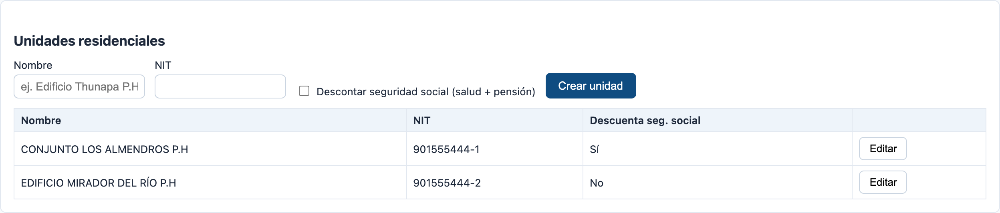

Se crea una unidad con su **«Nombre»** y su **«NIT»**. La casilla
**«Descontar seguridad social (salud + pensión)»** decide si a los empleados de esa unidad
se les descuenta el 4 % de salud y el 4 % de pensión: hay unidades que lo hacen y otras que
no. **«Editar»** permite corregir cualquiera de los tres datos sin salir de la tabla.

### Conceptos fijos por unidad

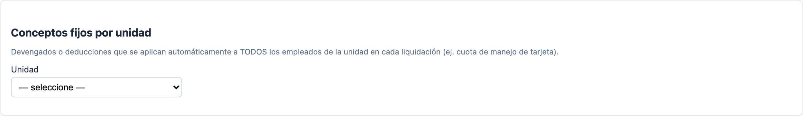

Devengados o deducciones que se aplican **automáticamente a todos los empleados** de la
unidad en cada liquidación. El caso típico es la cuota de manejo de la tarjeta.

Se indica el **«Nombre»**, el **«Valor (quincena)»** y el **«Tipo»** (*Devengado* o
*Deducción*). La casilla **«Salarial (suma al IBC)»** solo tiene efecto en los devengados:
márquela si ese pago debe entrar en la base sobre la que se calculan los aportes.

### Empleados

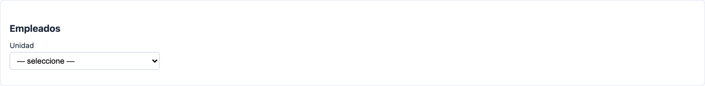

Alta de empleados de la unidad seleccionada: **«Nombre»**, **«Documento (CC)»**,
**«Cargo»** (vigilante, aseo, todero…) y **«Salario básico mensual»**.

La tabla tiene tres marcas que cambian la liquidación:

- **Activo** — un empleado inactivo no entra en la liquidación.
- **Incapacitado** — no se le paga auxilio de transporte, salvo que se prorratee por lo
  laborado (§6).
- **Ocasional** — igual que el anterior en cuanto al auxilio.

> **Eliminar o desactivar.** Si un empleado ya tiene turnos, liquidaciones o conceptos
> registrados **no se puede eliminar**; la aplicación se lo dirá. En ese caso desmárquelo
> como *Activo*: sale de las liquidaciones futuras y se conserva el historial.

### Conceptos manuales (por empleado y quincena)

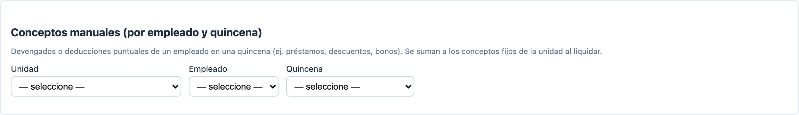

Lo puntual: un préstamo, un descuento, un bono. Se eligen en cascada la **«Unidad»**, el
**«Empleado»** y la **«Quincena»**, y luego se agrega el concepto con su nombre, su valor y
su tipo. Aquí el tipo por defecto es *Deducción*, que es lo más común.

Estos conceptos **se suman** a los conceptos fijos de la unidad al liquidar.

### Periodos de liquidación (quincenas)

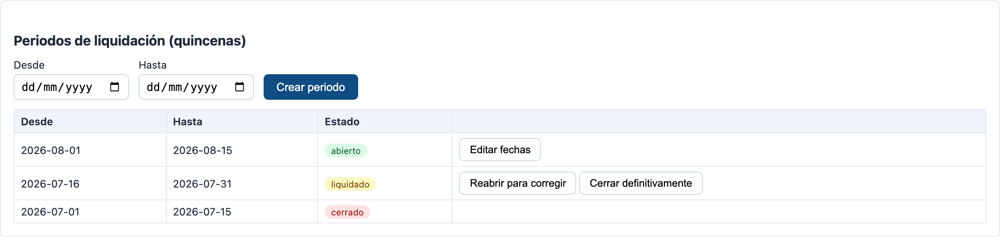

Se crea un periodo con **«Desde»** y **«Hasta»**. La columna **«Estado»** muestra la
insignia de color y las acciones disponibles cambian con ella:

- **abierto** → **«Editar fechas»**.
- **liquidado** → **«Reabrir para corregir»** y **«Cerrar definitivamente»**.
- **cerrado** → ninguna acción.

Ésta es la sección a la que hay que volver cuando el cuadro de turnos le diga que el
periodo no está abierto.

---

## 5. Cuadro de turnos

Elija la **«Unidad residencial»** y la **«Quincena»**. Aparece una matriz con un empleado
por fila y un día por columna.

### Escribir un turno

Escriba el turno en la celda y presione **Enter**. Se acepta:

| Lo que escribe | Lo que entiende |
|---|---|
| `06:00-18:00` | De 6 de la mañana a 6 de la tarde |
| `18-6` | De 18:00 a 06:00 — **cruza medianoche** |
| `6:30-14` | De 6:30 a 14:00 |

- **Celda vacía = descanso.** No hay que escribir nada.
- Para un **turno partido**, escriba el segundo turno en la misma celda y presione Enter de
  nuevo: los turnos se apilan.
- La **×** dentro de cada turno lo elimina.

Todo lo que hace aquí **se guarda de inmediato**.

### Qué significa cada color y cada símbolo

| Símbolo | Significa |
|---|---|
| 🗂 | Abre la **tarjeta de turnos** de ese empleado (§6) |
| **✦** junto al día | Ese día es festivo |
| Columna rosada | Domingo o festivo |
| **✚** rojo junto al nombre | Empleado incapacitado |
| Turno **lila** | Cruza la medianoche |
| Turno **ámbar** | Marcado como *jornada ordinaria* (§6) |
| **×** | Eliminar ese turno |
| Casilla **«ord.»** | Marca de jornada ordinaria (§6) |

Al hacer clic en una celda se resaltan su fila y su columna, como en una hoja de cálculo,
para no perderse en quincenas largas.

### La columna «Total h»

La grilla es ancha y no cabe entera en pantalla: **se desplaza horizontalmente**. Al final
de todo está la columna **«Total h»** con las horas de la quincena de cada empleado.

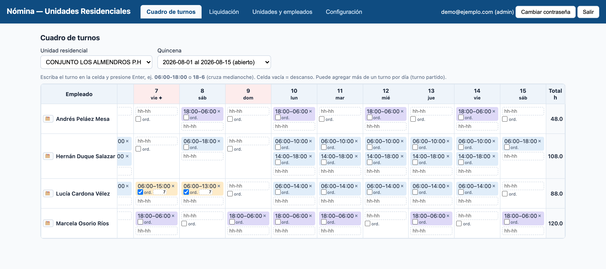

### Cuando el periodo no está abierto

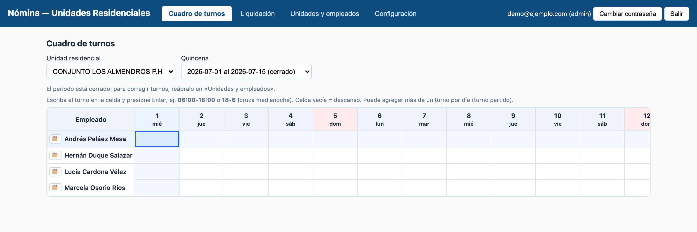

Si la quincena ya está liquidada o cerrada, la grilla se muestra sin campos de edición y
aparece el aviso *«El periodo está cerrado: para corregir turnos, reábralo en “Unidades y
empleados”.»* Un periodo **cerrado no se puede reabrir**.

---

## 6. Previsualización de turnos (formato tarjeta)

Es la pantalla más completa de la aplicación y donde se resuelven los casos difíciles.
Reproduce la **tarjeta de turnos en papel**: un empleado, un día por fila.

### Cómo se abre y se cierra

Se abre con el botón **🗂** que está junto al nombre de cada empleado en el cuadro de
turnos (*«Previsualizar turnos (formato tarjeta)»*).

Se cierra con **«Cancelar»**, o haciendo clic en el fondo oscuro. *(La tecla Escape no la
cierra.)*

### El encabezado

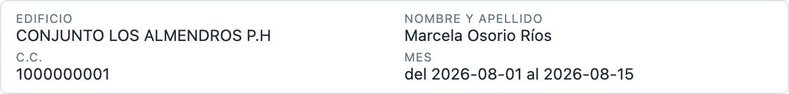

**EDIFICIO**, **NOMBRE Y APELLIDO**, **C.C.** y **MES** (el rango de la quincena). Si el
empleado está incapacitado, junto al nombre aparece una cruz roja **✚**.

### Estado del empleado

Tres casillas — **Activo**, **Incapacitado**, **Ocasional** — que son las mismas de
*Unidades y empleados*. Están aquí para no tener que cambiar de pestaña a mitad de la
digitación, y **se guardan en el momento** en que las marca.

### La tabla, columna por columna

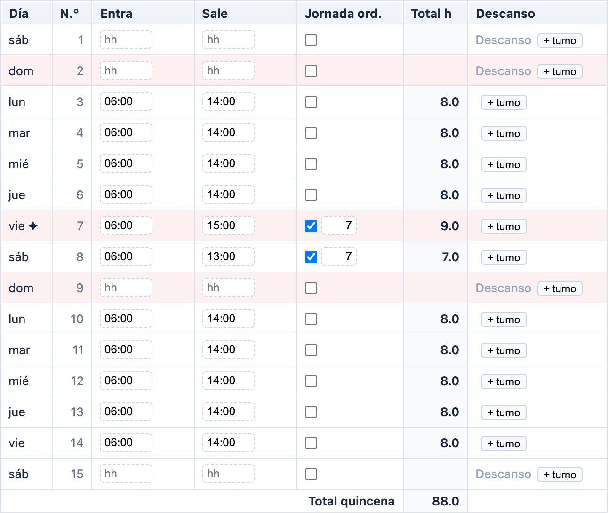

| Columna | Qué es |
|---|---|
| **Día** | Abreviatura del día, con **✦** si es festivo |
| **N.º** | Día del mes |
| **Entra** | Hora de entrada. Acepta `6`, `18`, `18:30` |
| **Sale** | Hora de salida, con **×** para quitar esa línea |
| **Jornada ord.** | Casilla de *jornada ordinaria* y, si está marcada, el umbral en horas |
| **Total h** | Horas de ese día |
| **Descanso** | Dice **«Descanso»** si el día está en blanco. Aquí está el botón **«+ turno»** |

Las filas de domingos y festivos se pintan de rosado. Al pie de la tabla, la fila
**«Total quincena»** suma todo.

### Lo más importante: aquí los cambios no se guardan solos

En el cuadro de turnos cada cosa que escribe se guarda de inmediato. **En la tarjeta no.**
Los horarios que escriba quedan en un borrador y solo se aplican cuando pulsa
**«Guardar cambios»**. Si pulsa **«Cancelar»** o cierra la ventana, se pierden.

Al guardar, la aplicación compara el borrador con lo que hay en el servidor y **solo toca
lo que cambió**: los turnos que quedaron igual no se borran ni se vuelven a crear.

> **Única excepción:** la casilla de *jornada ordinaria* de un turno **que ya estaba
> guardado** se aplica de inmediato, igual que en la grilla. Si la fila es nueva, la marca
> espera al «Guardar cambios».

### Turnos partidos

**«+ turno»** agrega otra línea de *Entra* / *Sale* al mismo día. La **×** quita una línea.
El borrado real ocurre al guardar.

### Jornada ordinaria y turnos de relleno

Ésta es la parte que conviene leer con calma.

A veces hay que registrar un turno **no porque el empleado lo haya trabajado**, sino para
cuadrar las horas de la quincena. Marcar ese turno como *jornada ordinaria* le dice al
sistema:

> las primeras **N** horas indicadas no pagan recargo festivo ni nocturno —las cubre el
> salario—, y solo el excedente sobre N se reconoce, como hora extra con el tipo de día
> real.

Hay tres situaciones:

**a) Marcar la casilla en un día que ya tiene turno.** El horario no se toca; solo se le
pone el umbral (7 horas por defecto, editable).

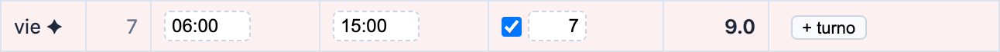

En el ejemplo, un turno real de 06:00 a 15:00 en el festivo del 7 de agosto, con umbral 7:
de las 9 horas, 7 las cubre el salario y solo **2 se pagan como extra festiva**.

**b) Marcar la casilla en un día vacío → se crea un *turno de relleno*.** La fila se llena
sola con **06:00 – 13:00** (7 horas). Usted no escribe el horario: lo pone el sistema.

**c) Desmarcar la casilla:**

- si la fila era un **turno de relleno**, el día se vacía por completo y vuelve a decir
  **«Descanso»**;
- si era un **turno real**, solo se le quita la marca; el horario se queda.

Dos detalles útiles:

- En un turno de relleno, **cambiar el umbral cambia el horario**: si pone 5, la fila pasa a
  06:00 – 11:00.
- Si usted **edita a mano** la hora de un turno de relleno, deja de ser de relleno: a partir
  de ahí el umbral y el horario van por separado.

*(La hora 06:00 no es casual: los turnos nocturnos terminan a esa hora, y así el turno de
relleno nunca choca con el turno de la noche anterior.)*

### Los tres ajustes de la quincena

Al pie de la tarjeta hay tres casillas que cambian **cómo se le paga a ese empleado en esa
quincena**. Se guardan en el momento en que las marca.

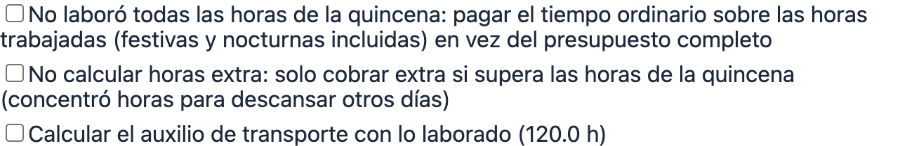

**1. «No laboró todas las horas de la quincena…»**

Cuándo marcarla: el empleado entró o salió a mitad de quincena, o faltó varios días.

Qué cambia: el tiempo ordinario se paga sobre **las horas que realmente trabajó** —festivas
y nocturnas incluidas— en vez de sobre el presupuesto completo de la quincena. No suprime
nada más: dominicales, recargos nocturnos y extras se siguen liquidando aparte.

**2. «No calcular horas extra…»**

Cuándo marcarla: el empleado concentró sus horas en pocos días para descansar otros, pero
en total **no** superó las horas de la quincena.

Qué cambia: solo se le cobra extra lo que exceda el presupuesto quincenal. Los recargos
nocturno y dominical se mantienen intactos.

**3. «Calcular el auxilio de transporte con lo laborado (N h)»**

Cuándo marcarla: el empleado no trabajó la quincena completa y el auxilio debe pagarse en
proporción.

Qué cambia: el auxilio se paga como *auxilio mensual × horas trabajadas ÷ horas del mes*,
en vez del auxilio quincenal completo. Con una quincena completa da exactamente lo mismo
que el auxilio plano.

> **Ojo:** esta marca **manda** sobre *Incapacitado* y *Ocasional*. Normalmente esos dos
> estados quitan el auxilio por completo; si esta casilla está marcada, el auxilio **sí se
> paga**, prorrateado.

El número entre paréntesis son las horas del borrador, así que **cambia mientras usted
digita**.

Así se ve un empleado que entró a mitad de quincena, con la primera y la tercera marcadas:

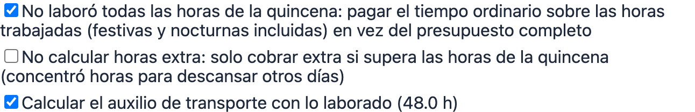

Y así queda su liquidación: tiempo ordinario sobre 48 horas en vez de 105, y auxilio de
transporte prorrateado.

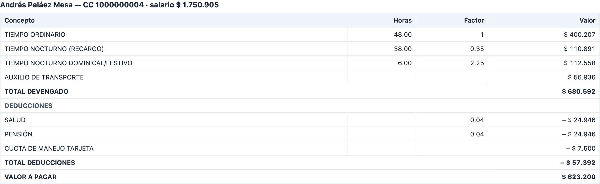

### En solo lectura

Si el periodo no está abierto, la tarjeta muestra los horarios como texto (un guion donde
no hay nada), desaparecen las **×**, los **«+ turno»** y las casillas, y el único botón es
**«Cerrar»**.

---

## 7. Liquidación y Excel

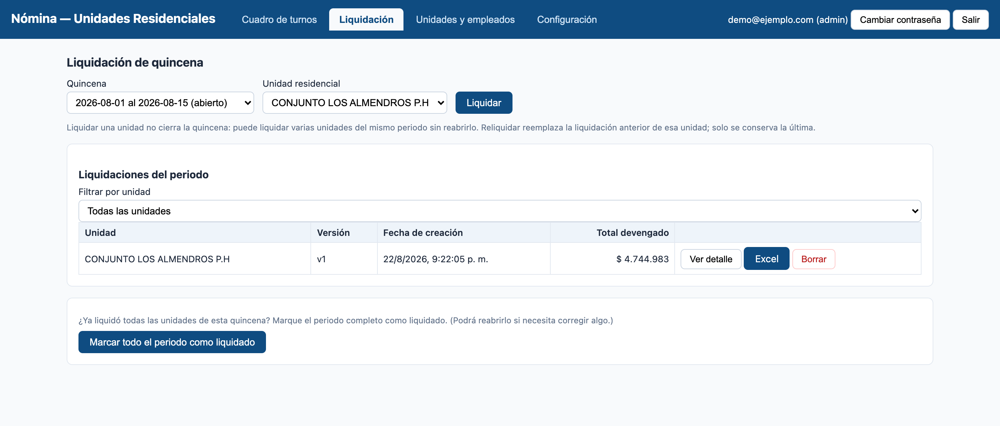

Elija la **«Quincena»** y la **«Unidad residencial»** y pulse **«Liquidar»**.

Liquidar una unidad **no cierra la quincena**: puede liquidar varias unidades del mismo
periodo, una tras otra, sin reabrir nada. Si esa unidad ya tenía liquidación, la aplicación
le pide confirmación y la **reemplaza**; solo se conserva la última.

### Liquidaciones del periodo

La tabla de abajo lista lo liquidado, con su **«Versión»**, la **«Fecha de creación»** y el
**«Total devengado»**. El selector **«Filtrar por unidad»** ayuda cuando el periodo tiene
muchas. Cada fila ofrece tres acciones:

- **«Ver detalle»** — abre el desglose.
- **«Excel»** — descarga el archivo.
- **«Borrar»** — elimina esa liquidación (pide confirmación).

### El desglose

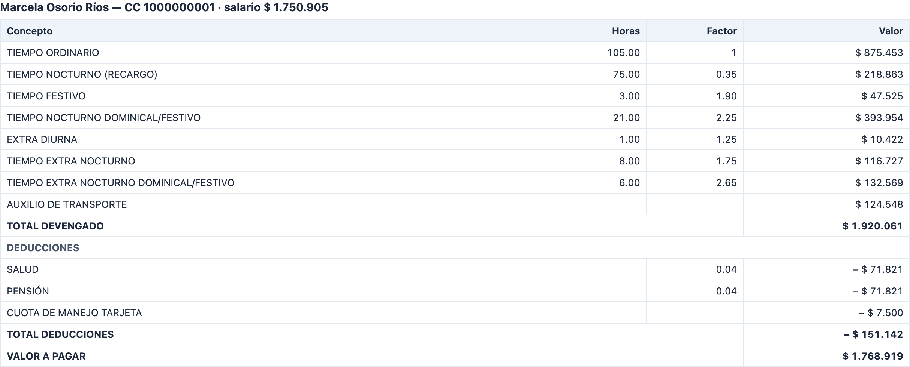

Por cada empleado se muestra su nombre, cédula y salario, y una tabla de
**Concepto · Horas · Factor · Valor**:

- **TOTAL DEVENGADO** — todo lo que se le paga.
- **DEDUCCIONES** — salud, pensión, conceptos fijos de la unidad y conceptos manuales.
- **VALOR A PAGAR** — lo que efectivamente recibe.

> **Truco:** pase el cursor por encima del nombre de un concepto y verá **de qué se compone
> su factor** (por ejemplo `hora_base: 1 + recargo_dominical_festivo: 0.90`). Es la forma
> de verificar de dónde salió cada peso.

### El Excel

El botón **«Excel»** descarga el archivo con el formato de la planilla:

- una hoja **por empleado**, con sus conceptos, el total devengado, las deducciones y el
  valor a pagar;
- una hoja **RESUMEN** con una fila por empleado y el total de la unidad;
- una hoja **APROPIACIONES** —solo cuando se liquida la **segunda** quincena del mes y la
  primera ya está liquidada— con las bases «con auxilio» y «sin auxilio» de las dos
  quincenas y las columnas de SENA, ICBF, caja de compensación, salud, pensión, ARL,
  vacaciones, prima, cesantías e intereses.

---

## 8. Configuración

Solo visible para el rol **admin**.

### Parámetros legales

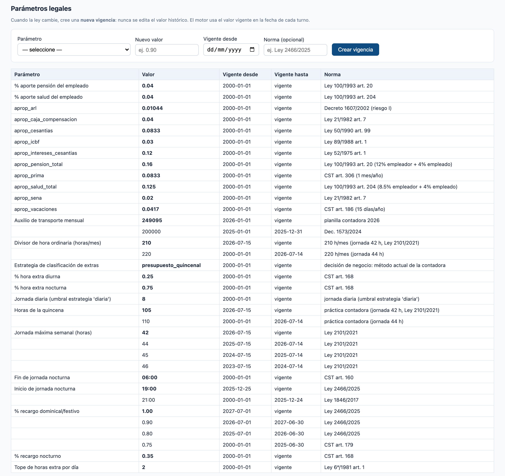

Aquí viven todos los valores legales: porcentajes de recargo, horarios de la jornada
nocturna, horas de la quincena, auxilio de transporte, aportes.

> **La regla que nunca se rompe:** cuando la ley cambia, se crea una **vigencia nueva**;
> **nunca** se edita el valor histórico. El motor usa el valor vigente **en la fecha de cada
> turno**, así que una quincena vieja se sigue liquidando con los valores de su época.

Para crear una vigencia: elija el **«Parámetro»**, escriba el **«Nuevo valor»**, la fecha
**«Vigente desde»** y, si la conoce, la **«Norma»** que lo sustenta. La vigencia anterior se
cierra sola el día antes.

La tabla de abajo agrupa por parámetro: la primera fila de cada grupo es el valor vigente
(en negrita) y debajo va el historial.

> ⚠️ Si aparece el bloque rojo **«Parámetros descuadrados»**, léalo: significa que dos
> parámetros que deben moverse juntos (*horas de la quincena* y *divisor de hora ordinaria*)
> quedaron desalineados, y **las quincenas de esos rangos se están liquidando mal** hasta
> que se corrija.

### Festivos

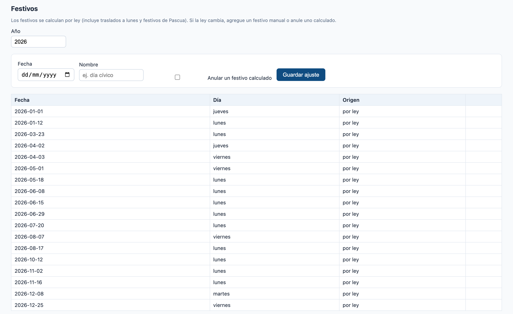

Los festivos se calculan por ley, incluidos los traslados a lunes y los que dependen de la
Pascua. Elija el **«Año»** para ver el listado.

Si la ley cambia o hay un día cívico, agregue un festivo indicando **«Fecha»** y
**«Nombre»**. Para quitar uno calculado, marque **«Anular un festivo calculado»** antes de
guardar. La columna **«Origen»** distingue los festivos *por ley* de los *manuales*, y solo
estos últimos se pueden revertir con **«Quitar ajuste»**.

### Usuarios

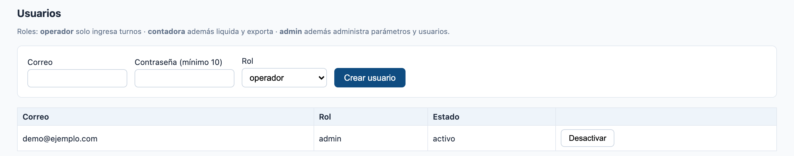

Alta de usuarios con su **«Correo»**, una **«Contraseña (mínimo 10)»** y su **«Rol»**.

**«Desactivar»** le cierra las sesiones abiertas y le impide volver a entrar. Los usuarios
no se borran: se desactivan, para no perder el rastro en la auditoría.

### Auditoría

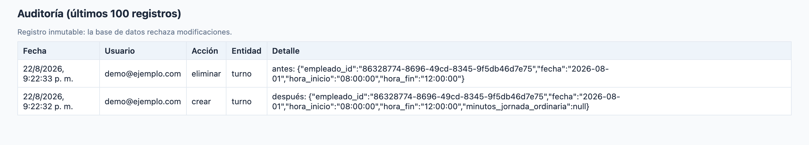

Los últimos 100 movimientos: **fecha, usuario, acción, entidad** y el detalle con el
*antes* y el *después* de cada cambio.

Este registro es **inmutable**: la base de datos rechaza cualquier intento de modificarlo o
borrarlo, incluso desde adentro.

---

## 9. Cerrar la quincena

Son dos pasos separados, a propósito.

**Paso 1 — marcar el periodo como liquidado.** Cuando ya liquidó todas las unidades, en la
pestaña *Liquidación* aparece el botón **«Marcar todo el periodo como liquidado»**. El
periodo pasa a 🟡 *liquidado* y los turnos quedan en solo lectura. **Todavía se puede
reabrir** desde *Unidades y empleados* → *Periodos* → **«Reabrir para corregir»**.

**Paso 2 — cerrar definitivamente.** En *Periodos*, un periodo liquidado ofrece
**«Cerrar definitivamente»**, con esta advertencia:

> *¿Cerrar definitivamente esta quincena? Quedará en SOLO LECTURA para siempre: no podrá
> reabrirse, ni modificar turnos, ni reliquidar.*

Es literal: **no hay vuelta atrás**. Haga este paso solo cuando la nómina ya se pagó y no
va a cambiar.

---

## 10. Problemas frecuentes

**«Turno inválido "…": use el formato inicio-fin, ej. 18:00-06:00»**
Faltó el guion entre la hora de entrada y la de salida. Escriba `18-6` o `18:00-06:00`.

**«Horas inválidas en "…"»**
Alguna de las dos horas no es una hora válida (por ejemplo `25:00`). Corríjala.

**«Horas inválidas el 2026-08-07: revise "…" / "…".»** *(en la tarjeta)*
Una fila quedó a medias —con hora de entrada pero sin salida, o al revés— o con una hora
mal escrita. Complétela o déjela **completamente en blanco** para que ese día quede como
descanso.

**«La unidad no tiene empleados: créelos en “Unidades y empleados”.»**
La unidad existe pero no tiene personal. Créelo en esa pestaña.

**«El periodo está liquidado/cerrado: para corregir turnos, reábralo en “Unidades y
empleados”.»**
Vaya a *Periodos de liquidación* y use **«Reabrir para corregir»**. Si el periodo está
**cerrado**, no se puede: el cierre es definitivo.

**No me deja eliminar un empleado.**
Tiene turnos, liquidaciones o conceptos registrados. Desmárquelo como **Activo** en vez de
borrarlo: sale de las liquidaciones futuras y el historial se conserva.

**Marqué un ajuste en la tarjeta y no cambió nada en el Excel.**
Los ajustes se guardan al instante, pero la liquidación no se recalcula sola: hay que
**volver a liquidar** la unidad y descargar el Excel de nuevo.

**Escribí horarios en la tarjeta y se perdieron.**
En la tarjeta los horarios solo se aplican con **«Guardar cambios»**. Si cerró con
«Cancelar» o haciendo clic afuera, el borrador se descarta.

**Las horas de la quincena no me cuadran con la planilla.**
Revise en *Configuración* → *Parámetros legales* que no aparezca el aviso rojo
«Parámetros descuadrados», y que la fecha de la quincena caiga en la vigencia que espera.

---

## 11. Glosario

| Término | Significa |
|---|---|
| **Quincena** | Periodo de liquidación de unos 15 días |
| **Turno** | Intervalo trabajado por un empleado; puede cruzar medianoche |
| **Turno partido** | Dos o más turnos el mismo día |
| **Descanso** | Día sin ningún turno |
| **Jornada nocturna** | Franja con recargo, hoy 19:00–06:00 |
| **Recargo nocturno** | Sobrecosto por trabajar de noche dentro de la jornada ordinaria (hoy +35 %) |
| **Hora extra** | Hora que excede la jornada máxima: diurna +25 %, nocturna +75 % |
| **Dominical / festivo** | Trabajo en domingo o festivo (recargo hoy +90 %; sube a +100 % el 1-jul-2027) |
| **Jornada ordinaria** *(marca de turno)* | Turno registrado solo para cuadrar horas; sus primeras N horas las cubre el salario |
| **Turno de relleno** | Turno de jornada ordinaria creado por el sistema en un día vacío (06:00–13:00) |
| **Quincena incompleta** *(marca)* | El tiempo ordinario se paga sobre lo trabajado, no sobre el presupuesto |
| **Auxilio prorrateado** *(marca)* | El auxilio de transporte se paga en proporción a las horas trabajadas |
| **Devengado** | Lo que se le paga al empleado |
| **Deducción** | Lo que se le descuenta |
| **IBC** | Ingreso base de cotización: la base sobre la que se calculan los aportes |
| **Liquidación** | Resultado de calcular una quincena; inmutable una vez cerrada |
| **Vigencia** | Rango de fechas en que aplica un valor legal |
| **Festivo trasladado** | Festivo movido al lunes por la Ley Emiliani (51 de 1983) |

---

¿Falta algo o algo quedó confuso? La documentación técnica está en
[README.md](../README.md) y [arquitectura.md](arquitectura.md).
